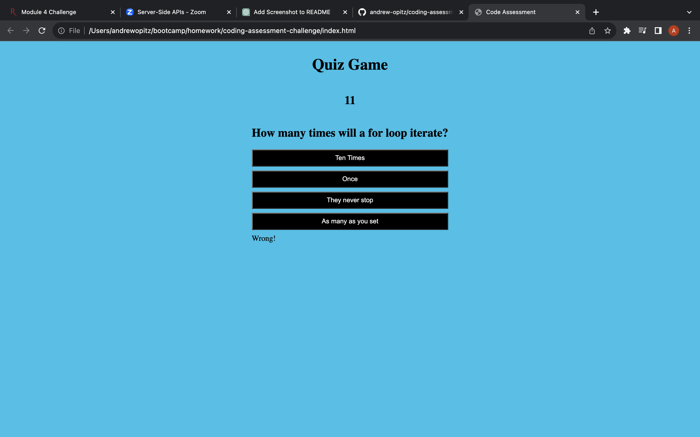

# coding-assessment-challenge
[LiveSite](https://andrew-opitz.github.io/coding-assessment-challenge/)

## Description
This website was created to be a practice assessment testing the users knowledge in Javascript. There are six questions for the user to answer in 60 seconds before being asked for their name and displaying their highscore.

## Installation
N/A

## Usage

## Credits
N/A

## License
Please refer to the license in the repo.